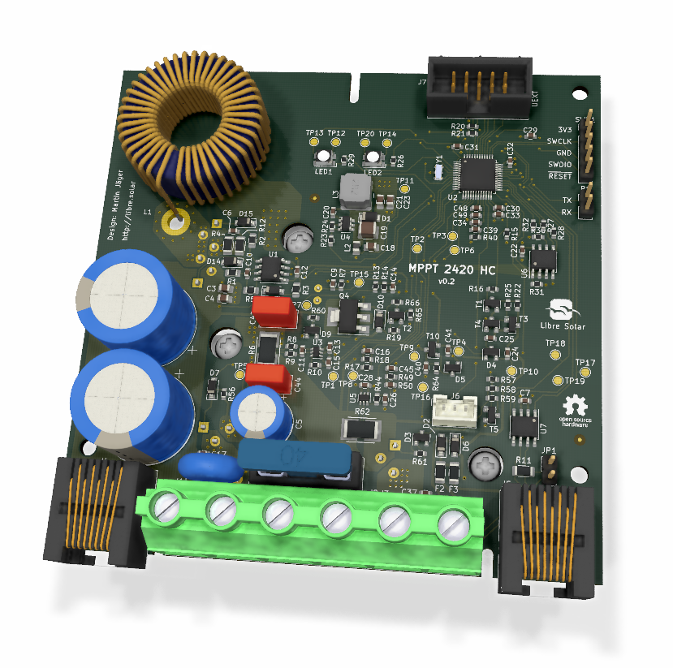

# MPPT charge controller with HS load switch and CAN

 Initial version of board design that is going to be produced.

Schematic: [PDF file](https://github.com/LibreSolar/mppt-2420-hc/raw/master/build/mppt-2420-hc_schematic.pdf)

Bill of Materials: [CSV file](build/mppt-2420-hc_bom_(hv_supply,can).csv) or [interactive HTML BOM](https://libre.solar/mppt-2420-hc/build/mppt-2420-hc_ibom.html)

## Features

- Solar input terminal
    - Max. 80V (100V MOSFETs used)
    - DC/DC converter inductor current max. 20A
- Battery output terminal
    - 10 V - 32 V (supporting 12 V and 24 V battery systems)
    - Max. current: 20A (limited by inductor current)
- Load terminal: 20A
- New STM32G431 ARM MCU with advanced digital power conversion features
- Expandable via Olimex Universal Extension Connector (UEXT)
- Single RGB LED for status indication. Additional user interface can be included in separate PCB in front panel housing and connected via UEXT
- CAN interface via RJ45 connectors
